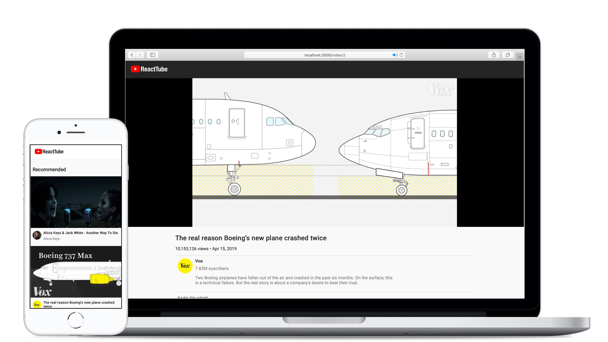
**Figure 1: How the final project will look both on mobile and desktop**

# Introduction

Welcome to the [React.js](https://reactjs.org) exercise. The objetive is to learn the basic building blocks of React by creating a website that copy the functionality of YouTube using a home page to browse videos and another page to watch it. After completing the project the student will be ready to investigate additional concepts to expand the functionality of the site, like adding a search bar and filter the results.

- Final project link: [React-Tube](https://react-tube-19e9e.firebaseapp.com)
- [Download the project assets](https://www.dropbox.com/sh/i23r1xjoytin3a7/AABqDoUJUmPsnV3dwf-3N6csa?dl=0): Videos, thumbnails and logo. Note: Add `*.mp4` to your project git ignore, because uploading videos to git takes to long.

## Pre requisites

These are concepts and files that will be mentioned during this guide, that the student must read before starting the project.

1. [JavaScript](https://2020.school/main/books/25): Complete most of the previous labs.
1. [CSS Grid](https://css-tricks.com/snippets/css/complete-guide-grid/): Used to lay out the cards in columns.
1. [CSS Flexbox](https://css-tricks.com/snippets/css/a-guide-to-flexbox/): To position elements inside components.

## Concepts to cover

1. [Create React App](https://reactjs.org/docs/create-a-new-react-app.html#create-react-app)
1. [React Components](https://reactjs.org/docs/components-and-props.html#function-and-class-components)
1. [React Props](https://reactjs.org/docs/components-and-props.html#props-are-read-only)
1. Asset loading (no link on purpose)
1. [Render multiple components](https://reactjs.org/docs/lists-and-keys.html)
1. [Routing in React](https://www.youtube.com/watch?v=Law7wfdg_ls)

# Setup

Our React project is organized in the following way:

## Templates

- Home page: To browse the videos.
- Video page: To watch the selected video.

## Modules

- Card: A group of HTML elements to display a video thumbnail with information about the title, author and channel image.
- Header: The element that appear on top of each page, can be modified to change its color and logo by toggling a boolean variable.

# 1. Create React App

Create React App is the name of the official way to set up React projects. Before we can use it, we need to install Node.js to access the Node Package Manager (NPM). Think of NPM as Maven in Java to manage JavaScript libraries. To download Node.js follow this link: [https://nodejs.org/en/](https://nodejs.org/en/) and install the LTS version. (Long Term Support)

Once Node is installed, proceed to the React page with instructions on how to create the project: [https://reactjs.org/docs/create-a-new-react-app.html#create-react-app](https://reactjs.org/docs/create-a-new-react-app.html#create-react-app)

Open your terminal and type:

```
npx create-react-app react-exercise
cd react-exercise
npm start
```

If you are using VSCode your IDE should have a project looking like this:

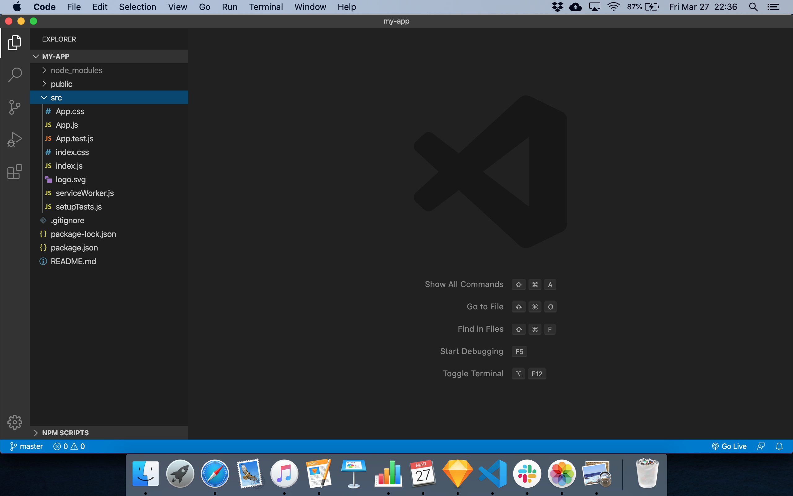
**Figure 3: Create React App project structure**

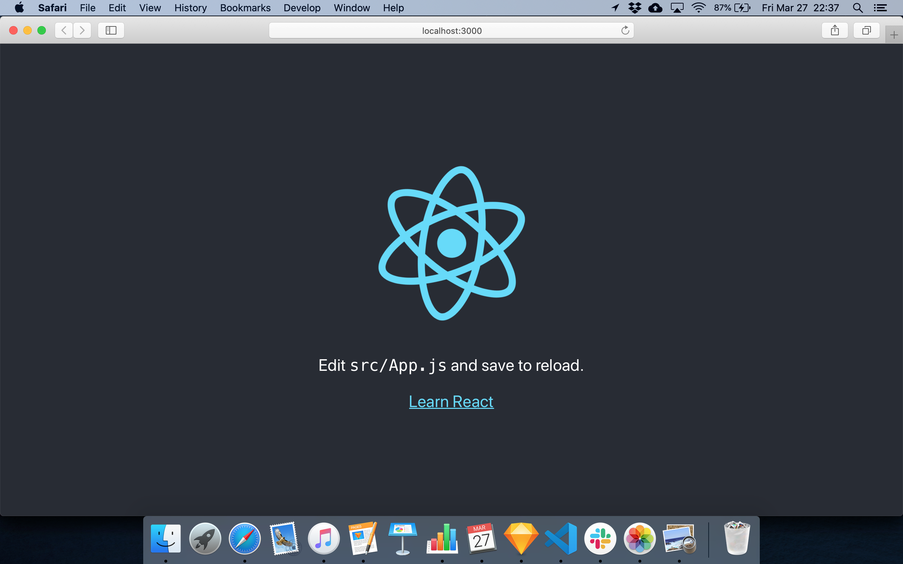
**Figure 4: Project running successfully**

# 2. React Components

Before writing our first component, let's analyze some Javascript topics related to the Create React App template:

- The code starts and runs from a file called `App.js` inside the src folder. It's the equivalent of the `Main.java` in your previous projects.
- In `App.js` you can see a function called `App()` that acts as the main class of the project.
- The function returns a something almost identical to HTML called JSX, but in reality is closer to JavaScript code that will be converted into real HTML after compiling.
- React uses JSX instead of HTML because it allows to insert variables and build complex interfaces using components. Think of components as Lego blocks. You can mix and match to build more complex structures.
- To build this project Create React App installed Webpack a framework equivalent to Gradle in your previous Java projects.
- For this project you don't need to worry about Webpack the Create React App configured everything for you.

## Create component

With the basic explanation out of the way, let's focus on building the card component, to show the videos available, and in a later step create a list of this cards using information stored in a JSON file.

Create a file called Card.js using the following structure:

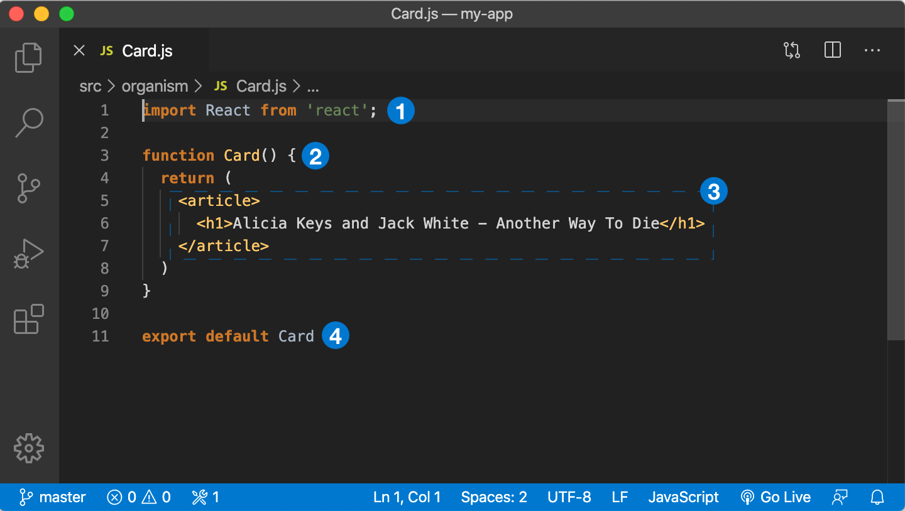
**Figure 5: Basic component structure for the Card**

1. Import React so the compiler can understand how to render the file using the React framework.
2. The Card function contains our component information, it can contain visual elements (render), its own local variables, receive props, etc. All of this will be covered in this exercise.
3. The return function has the JSX code that will be rendered in the web browser.
4. Because JavaScript files can contain multiple functions, the export default command tells the compiler which function to use. For learning purposes, in this project we will write only one function per file.

## Import component

Let's go back to our `App.js` file on the top and import the newly created card:

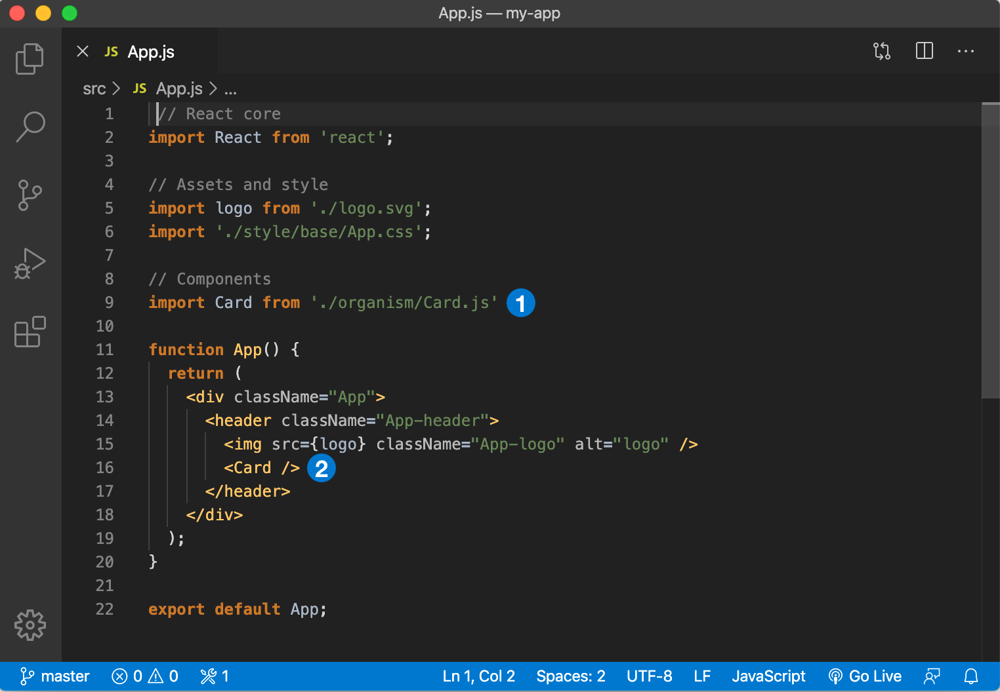
**Figure 6: Importing components in React**

1. Import your card component.
2. Add a Card instance of the component inside the App return function.
3. Optional, delete all other html tags but the image logo, to remove unused code.

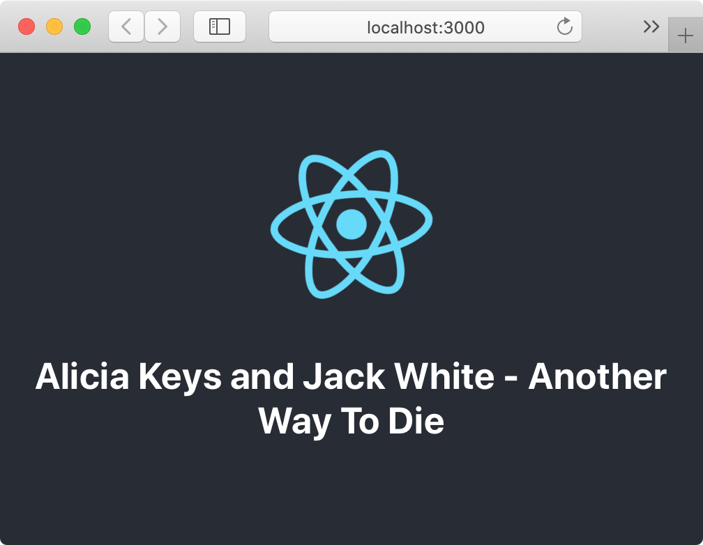
**Figure 7: Expected result**

# 3. React Props

It's time to pass information from the parent `App.js` to the child `Card.js`. We use something called [Props](https://reactjs.org/docs/components-and-props.html#props-are-read-only), that is a streamlined way to send information from a parent to child relationship (remember your UML classes)

To send a prop in react follow this steps:

## Parent (the sender)

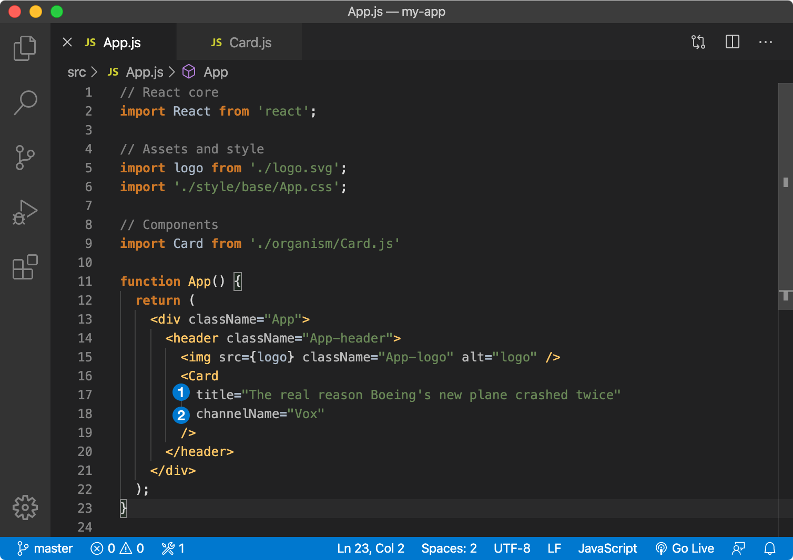
**Figure 8: Adding props to App.js**

1. Add a property, in this case title with the string value of the video title.
2. You can add as many props as necessary, but if you need to send many of the same type, is better to pack them in an array or object.

## Child (the receiver)

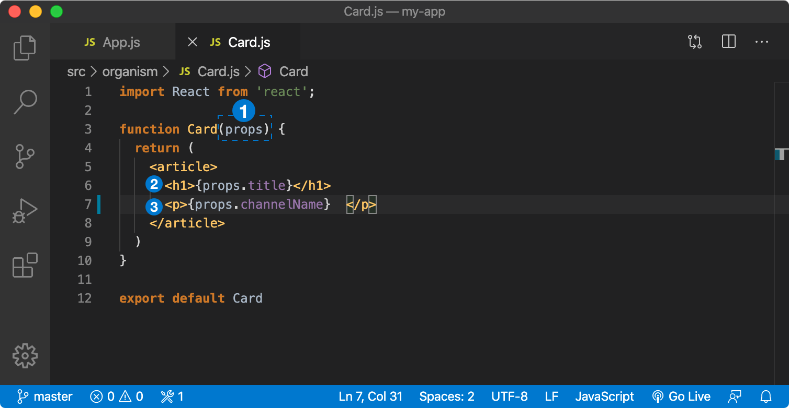
**Figure 9: Adding props to Card.js**

1. Write the keyword props as the function argument.
2. Props is an object, to access the values passed from the parent use `props.title` or `props.channelName`.
3. Note, the curly braces inside points #2 and #3, if you don't use them, the line &quot;props.title&quot; will be rendered as a string of text instead of the props received.

# 4. Asset loading

Let's start automatizing the process of writing data into the card. We have a JSON file that has an array of 12 objects.

If you remember the FileReader and ObjectStream methods of Java, you will be relieved that is so much easier to import and read files in JavaScript thanks to Node.js and Webpack.

To import a JSON file and use, you only need to do this:

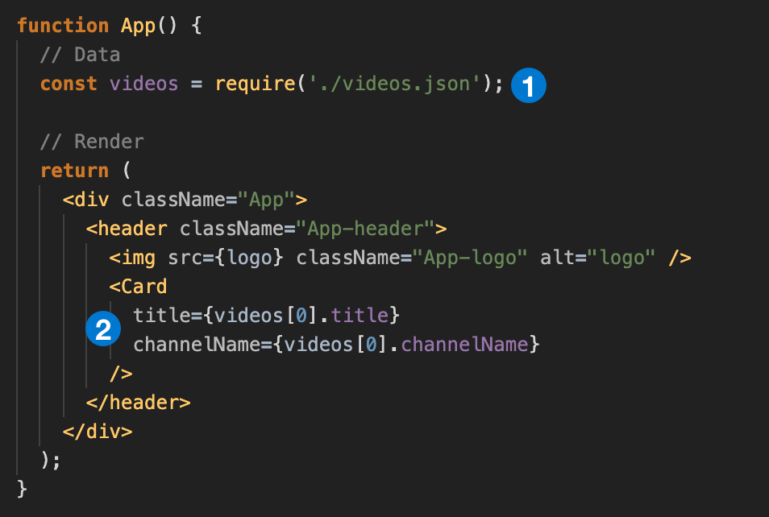
Figure 11: Loading assets using require

1. Create a constant called videos and use the method require and pass as a value the location of the file.
2. Replace the strings to variables using curly braces. Because the json is an array, we use the square braces [ ] with the index 0 to access the first object, and then the keys title and channelName.

Hey that was easier than using FileReader and ObjectStream no? Welcome to JavaScript, you will love it!

# 5. Render multiple components

As stated before we have the information of 12 videos inside the JSON, we could copy the component Card inside App.js 12 times but please don't do that. Instead let's learn the correct way to render multiple components of the same type in React.

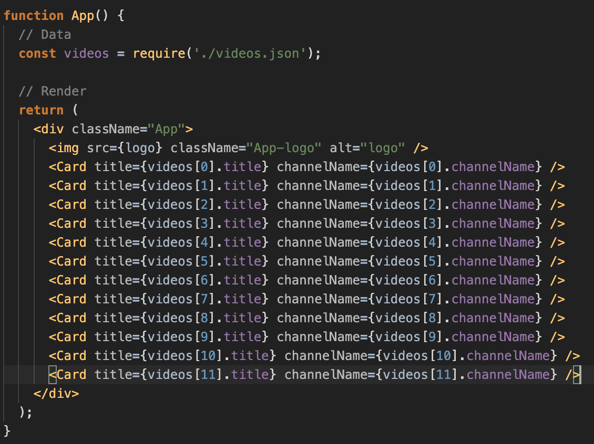
**Figure 12: You will fail the exercise if you do this**

Because of the React architecture, the return function can only contain JSX code (the tags that look like HTML) and send/receive data via props. We aren't allowed to create a for loop inside the JSX.

To solve this, we can create a constant that do the for loop beforehand and then pass it the return function to be rendered. For the explanation of the map function, please research about the methods map, filter and reduce introduced in the ES6 version of JavaScript.

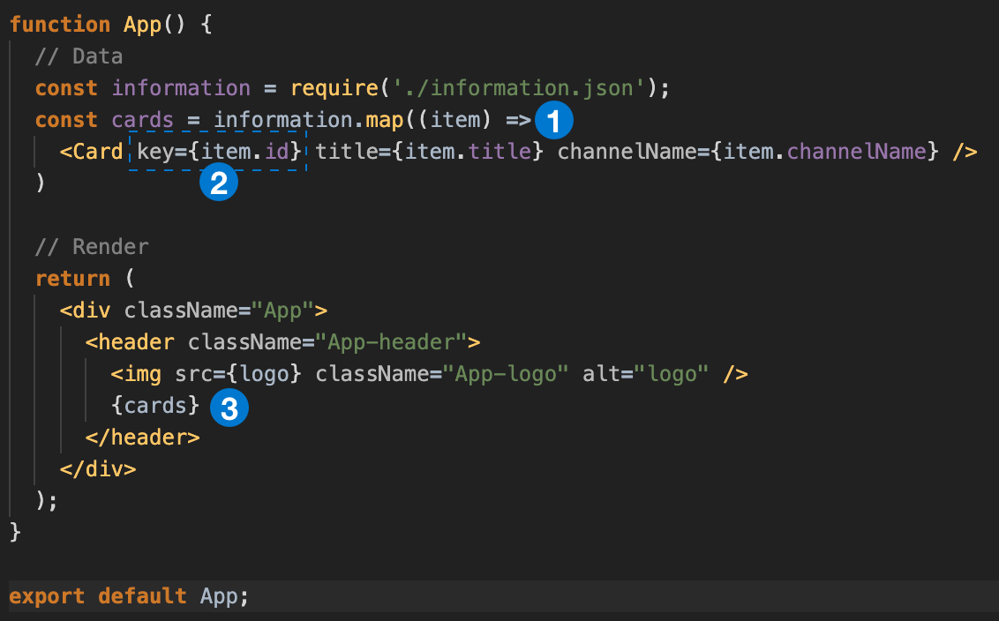
**Figure 13: Rendering multiple elements and inserting the result as a property**

1. We create a constant called cards that uses the method map to create an array of Cards.
2. To render multiple elements using a loop, React needs a unique id for each element. We add this required id using the prop called key and pass the id's inside our JSON. If the JSON does not have id's, you can see how to generate one by reading about the map method.
3. Now on the return function we delete our old Card component as pass the cards property using curly braces.

Now before moving to the next section, add the image thumbnail for the video and channel, and use your knowledge of CSS to style the cards.

# 6. Routing in React

Routing is the ability of a web application to pass data between diferent HTML pages. In this case we will use to change `App.js` from a single file to a more complex website consisting of multiple pages.

To start use the terminal to install React Router Dom:

```
npm install react-router-dom
```

Before proceeding, please refactor the project. Move the card presentation from `App.js` to a new component called `HomePage.js`. With this we can proceed to import the Router classes. The App should now look like this:

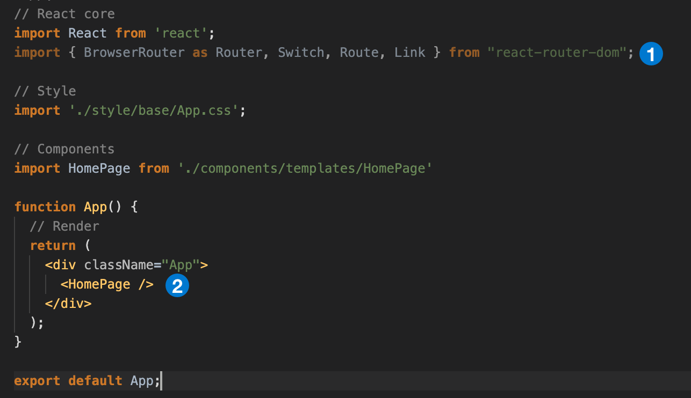
**Figure 14: The App refactored to prepare to use the Router system**

1. Import all Router dependencies. Note: The color is grayed out because we have not used it in the project yet.
2. The previous code to load the cards and render them was moved to a component called HomePage.

## Key concepts in Routing

To complete the project check if you can read and understand the official Router documentation or watch this excellent [YouTube video tutorial](https://www.youtube.com/watch?v=Law7wfdg_ls). Look for the following concepts to complete the task:

1. `<Link>`: is a JSX tag similar to the `<a>` tag in HTML.
1. `to={}`: is the Link property similar to the `href=""` in anchor tag.
1. `<Switch>`: is a JSX wrapper tag to group the pages to navigate.
1. `<Route>`: is the page to navigate to.
1. `path=''`: the url that will be formed when a user opens a Route.
1. `{match}`: A special argument in a template component to receive data from a route. It extract the url to extract the data as a prop.

We have reached the end of this `readme.md` file.

Task left to complete for the students:

1. Investigate the terms listed above.
1. Do the routing from `App.js` to both `HomePage.js` and `ResultsPage.js`.
1. Do the CSS styling for both pages using the HTML CV exercise as a reference.
1. Read about the html video tag to display the video using the require method.
1. Read about the html video tag to display the video using the require method.

Final project link: [React-Tube](https://react-tube-19e9e.firebaseapp.com)

Tip: Don't forget to use the Developer Tools (`⌘` + `⇧` + `C` in Chrome) when viewing the above link, it let's you see the source HTML which you can use as inspiration for your design.

For students that want to learn more, click the [OPTIONAL.md](./OPTIONAL.md) file for adding extra functionality.
